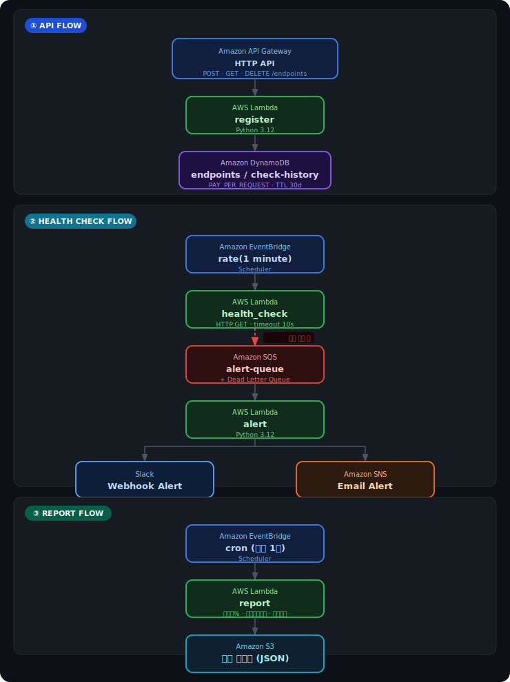
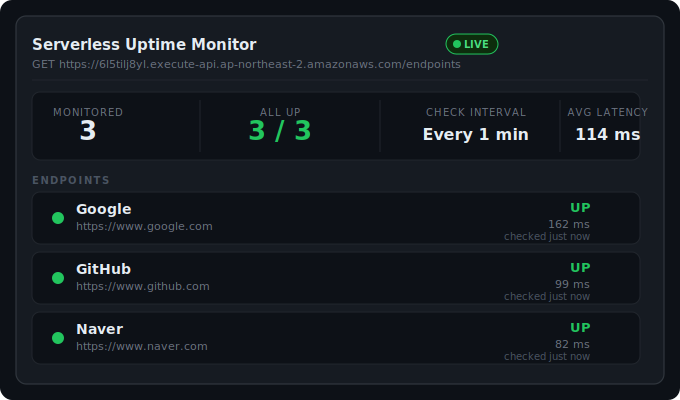
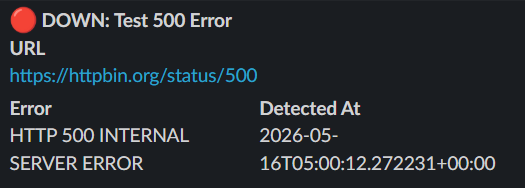
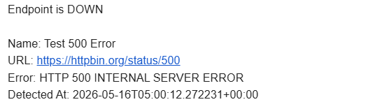

# serverless-uptime-monitor

EC2 없이 순수 서버리스 아키텍처로 구현한 업타임 모니터링 서비스입니다.  
엔드포인트를 등록하면 EventBridge가 1분마다 헬스체크를 실행하고, 장애 감지 시 SQS → Lambda → Slack/Email 알림을 자동으로 발송합니다.

## Architecture



## Demo

**엔드포인트 모니터링 현황** — Google, GitHub, Naver를 1분 주기로 헬스체크



**장애 감지 시 Slack 알림** — UP → DOWN 전환 시 즉시 발송



**장애 감지 시 이메일 알림** — Amazon SNS를 통해 발송



> **Error 필드 설명**
> - `HTTP 500 Internal Server Error` — 서버 내부 오류
> - `HTTP 503 Service Unavailable` — 서버 과부하/점검
> - `Connection timed out` — 응답 시간 초과 (10s)
> - `DNS resolution failed` — 도메인 자체가 존재하지 않음

## Tech Stack

| 분류 | 기술 |
|---|---|
| Compute | AWS Lambda (Python 3.12) |
| Trigger | Amazon EventBridge |
| API | Amazon API Gateway (HTTP API) |
| Queue | Amazon SQS + DLQ |
| DB | Amazon DynamoDB (PAY_PER_REQUEST) |
| Alert | Amazon SNS + Slack Webhook |
| Storage | Amazon S3 |
| IaC | Terraform |
| CI/CD | GitHub Actions |

## API

| Method | Endpoint | Description |
|---|---|---|
| POST | `/endpoints` | 모니터링할 URL 등록 |
| GET | `/endpoints` | 등록된 엔드포인트 목록 조회 |
| GET | `/endpoints/{id}` | 특정 엔드포인트 상태 조회 |
| DELETE | `/endpoints/{id}` | 엔드포인트 삭제 |
| GET | `/endpoints/{id}/history` | 헬스체크 이력 조회 (최근 50건) |

### 요청 예시

```bash
# 엔드포인트 등록
curl -X POST https://{api-id}.execute-api.ap-northeast-2.amazonaws.com/endpoints \
  -H "Content-Type: application/json" \
  -d '{"url": "https://example.com", "name": "Example Site"}'

# 목록 조회
curl https://{api-id}.execute-api.ap-northeast-2.amazonaws.com/endpoints

# 이력 조회
curl https://{api-id}.execute-api.ap-northeast-2.amazonaws.com/endpoints/{id}/history
```

## 배포

### 사전 준비

- AWS CLI 설정
- Terraform >= 1.0
- S3 버킷 (Terraform 상태 저장용): `uptime-monitor-tfstate`

### 로컬 배포

```bash
cd terraform
cp example.tfvars terraform.tfvars
# terraform.tfvars 편집 후

terraform init
terraform plan -var-file=terraform.tfvars
terraform apply -var-file=terraform.tfvars
```

### GitHub Actions 배포

Repository Secrets에 다음을 등록합니다:

| Secret | 설명 |
|---|---|
| `AWS_ACCESS_KEY_ID` | IAM 액세스 키 |
| `AWS_SECRET_ACCESS_KEY` | IAM 시크릿 키 |
| `SLACK_WEBHOOK_URL` | Slack Incoming Webhook URL |
| `ALERT_EMAIL` | 장애 알림 수신 이메일 |

`main` 브랜치에 push하면 자동 배포됩니다.

## 주요 동작

- **헬스체크**: 1분마다 등록된 모든 엔드포인트에 HTTP GET 요청. 응답 코드 < 400이면 UP, 그 외 DOWN
- **알림 조건**: UP → DOWN으로 상태가 바뀔 때만 알림 발송 (중복 알림 방지)
- **이력 보존**: DynamoDB TTL로 30일 후 자동 삭제
- **월별 리포트**: 매월 1일 전월 업타임%, 평균 응답시간, 장애 횟수를 S3에 JSON으로 저장
